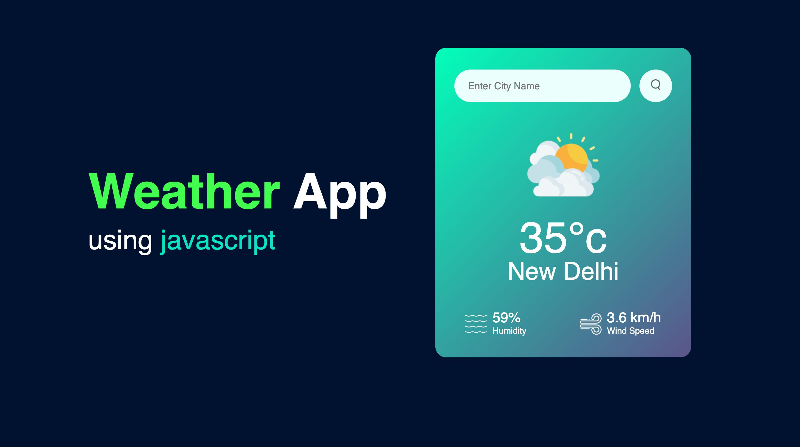
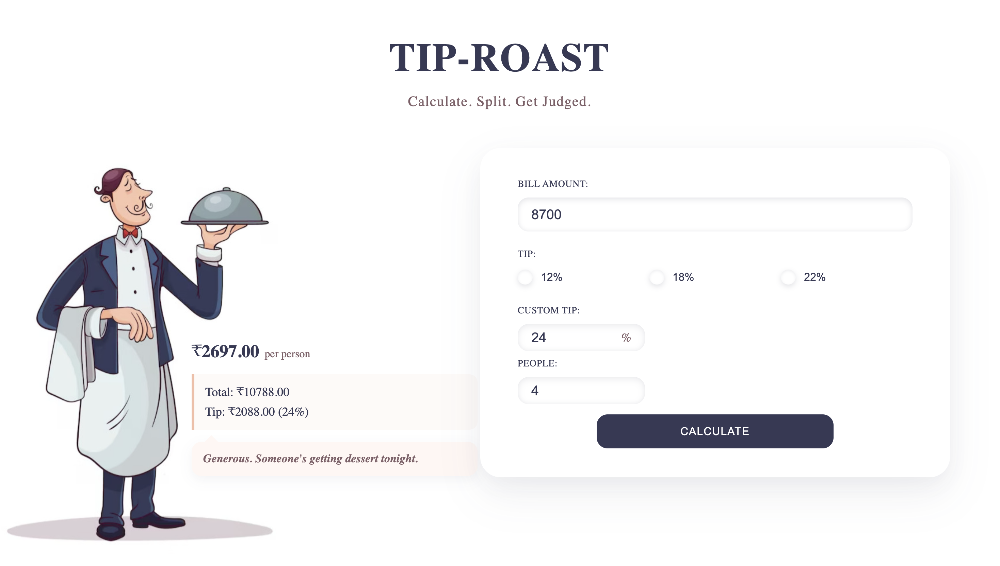

# 15DayDevRush

A structured collection of software projects developed as part of a 15-day development challenge. The repository documents practical implementations across web development, programming, and software engineering, with each project focused on learning through hands-on development and consistent execution.

## Projects

### 1. Weather App

A responsive weather application developed using HTML, CSS, and JavaScript. The application integrates the OpenWeather API to retrieve and display current weather information based on the selected city.



#### Key Features

- City-based weather search
- Real-time weather data retrieval
- Current temperature display
- Humidity information
- Wind speed information
- Dynamic weather condition icons
- Invalid city input handling
- Responsive user interface

#### Technologies

- HTML5
- CSS3
- JavaScript (ES6+)
- OpenWeather API

#### Project Structure

```text
weather_app/
├── images/
│   ├── clear.png
│   ├── clouds.png
│   ├── drizzle.png
│   ├── humidity.png
│   ├── mist.png
│   ├── rain.png
│   ├── search.png
│   ├── snow.png
│   ├── weather-app-preview.jpeg
│   └── wind.png
├── index.html
├── main.js
└── style.css
```

#### Getting Started

Clone the repository:

```bash
git clone https://github.com/YRshaurya/15DayDevRush.git
```

Navigate to the Weather App directory:

```bash
cd 15DayDevRush/weather_app
```

Configure your OpenWeather API key in `main.js`, then open `index.html` in a web browser.

#### API

This project uses the [OpenWeather Current Weather Data API](https://openweathermap.org/api) to retrieve current weather information.

For production deployments, API credentials should not be exposed directly in client-side source code. Use an appropriately restricted API key or a backend/serverless proxy to protect API credentials.

### 2. TipRoast

A playful bill-splitting and tip calculator developed using HTML, CSS, and JavaScript. The application calculates tips, splits bills between multiple people, and provides humorous feedback based on the user's tipping habits.



#### Key Features

- Bill amount calculation
- Preset tip percentage selection
- Custom tip percentage input
- Bill splitting between multiple people
- Per-person payment calculation
- Total bill calculation
- Tip amount calculation
- Interactive tip selection
- Dynamic calculation results
- Contextual taunts based on tipping behavior
- Responsive user interface

#### Technologies

- HTML5
- CSS3
- JavaScript (ES6+)

#### Project Structure

```text
TipRoast/
├── img/
│   └── image.jpg
├── index.html
├── main.js
└── style.css
```

#### Getting Started

Clone the repository:

```bash
git clone https://github.com/YRshaurya/15DayDevRush.git
```

Navigate to the TipRoast directory:

```bash
cd 15DayDevRush/TipRoast
```

Open `index.html` in a web browser to run the application.

#### Calculation

The application calculates the tip using:

```text
Tip Amount = Bill Amount × (Tip Percentage / 100)
```

The total bill is calculated as:

```text
Total = Bill Amount + Tip Amount
```

The amount per person is calculated as:

```text
Per Person = Total / Number of People
```

#### Design

TipRoast uses a minimal visual design featuring navy typography, muted wine accents, peach highlights, soft shadows, and an illustrated waiter. The interface combines a clean calculator layout with humorous feedback to create an interactive and engaging experience.

## Development

Each project in this repository is developed independently as part of the 15-day development challenge. The projects are intended to document practical learning, experimentation, and implementation across different areas of software development.

Additional projects will be added throughout the challenge.

## License

This repository is licensed under the MIT License. See the `LICENSE` file for details.
